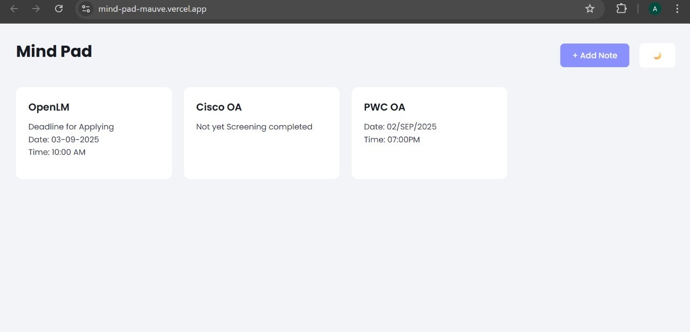

#  Mind Pad

*Mind Pad* is a modern, lightweight notes-taking web app built with *HTML, CSS, and JavaScript*.  
It lets you quickly add, edit, and delete notes, with a clean UI, dark mode support, and smooth interactions.

---
## 📸 Screenshot


---

##  Live Demo
[Click here to try MindPad](https://mind-pad-mauve.vercel.app/)


---

##  Features

-  *Add Notes* – Create new notes with a title and content.  
-  *Edit Notes* – Update existing notes easily.  
-  *Delete Notes* – Remove notes you no longer need.  
-  *Dark/Light Theme Toggle* – Switch between dark and light mode with one click.  
-  *Modern UI* – Responsive grid layout, hover animations, and smooth transitions.  
 

---

##  Project Structure

```bash
mind-pad/
│
├── index.html      # Main HTML file
├── style.css       # Styling (light + dark theme)
├── app.js          # JavaScript logic (CRUD operations)
└── README.md       # Project documentation


